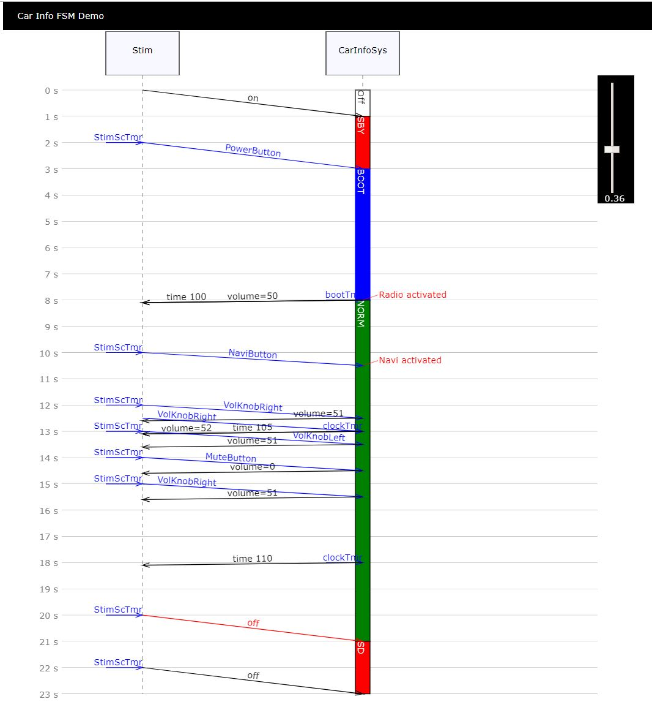

# Moddy
A discrete event simulator for concept analysis written in python.
System models are written in python.

Moddy generates sequence diagram, model structure graphs, finite state machine graphs and trace tables from the simulation

Typical applications are
- Modelling communication protocols
- Modelling highly distributed computer systems

Moddy comes with an interactive viewer for sequence diagrams where you can dynamically adjust the time scale:

Requires: Python >=3.5, svgwrite, Graphviz
