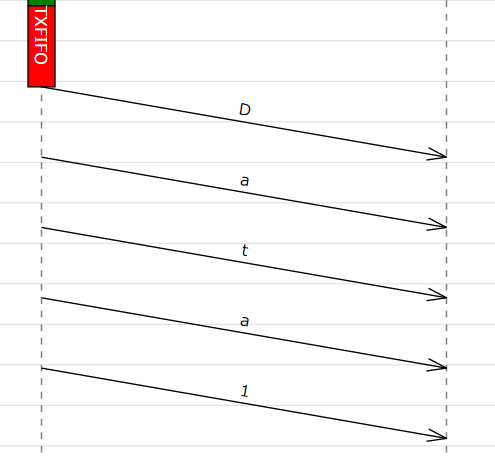
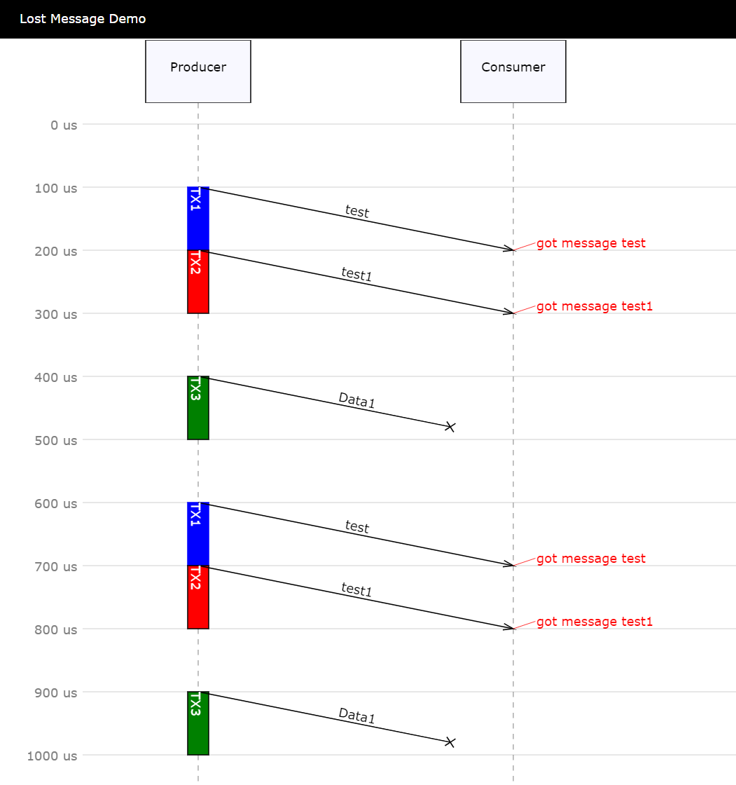
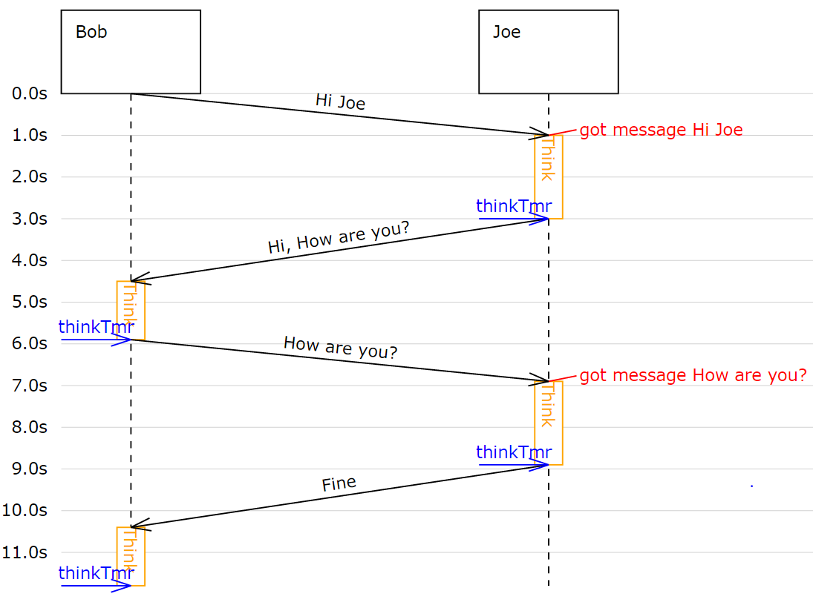
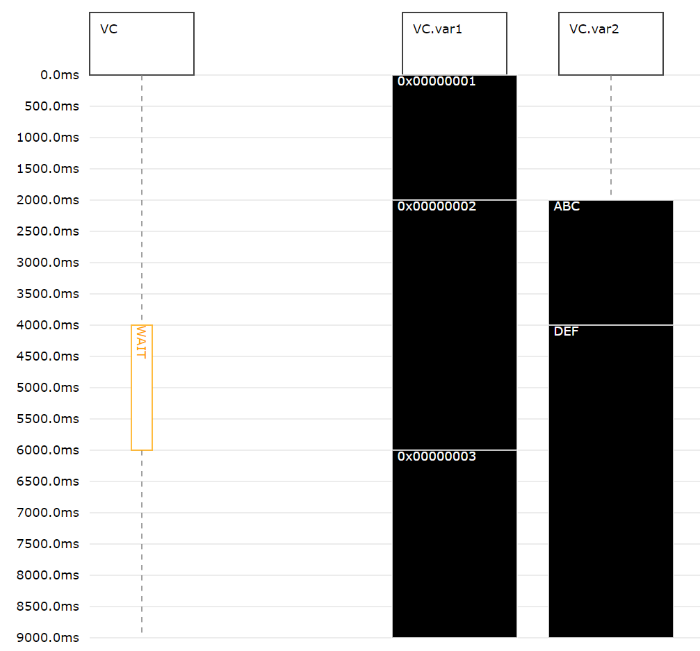

.. include ../globals.rst

.. _detailed_coresim:

***************
Core Simulator
***************

Initializing the Simulator
==========================

The simulator is the first class you must instantiate. The simulator constructor has no arguments:

.. code-block:: python

    import moddy
    simu = moddy.Sim()

The *simu* variable has to be passed to the parts.

Simulation Time
===============

The simulator time is the virtual time seen by the model while the simulation is running. 
It has nothing to do with the real time of the computer running the simulation. 
It is important to understand that the simulation time does NOT advance while the model is 
executing a callback function (like a message receive or timer expiration callback). 
This means all python statements in a callback routine are executed at the same simulation time. 

Time Unit
---------

Moddy's simulation time unit is seconds, i.e. the value 1.0 means one second. 
Because the simulator uses a floating point type for the simulation time, any time unit can be used by the model.

The globals *MS* (=1E-3), *US* (=1E-6) and *NS* (=1E-9) can be used conveniently to specify short times. Example:

.. code-block:: python

    from moddy import MS

    ...
    mypart.port1.send('down', 1*MS)	

The `1*MS` passes the value ``(1*1E-3) = 0.001`` to the send function.

Setting the Time Unit for Trace Outputs during Simulation
---------------------------------------------------------

To define the time unit for simulation outputs, use

.. code-block:: python
    
    simu.tracing.set_display_time_unit( unit )

where unit can be "s", "ms", "us" or "ns".

This setting affects only the trace outputs during the simulation run:

.. code-block:: console

    TRC:       8.9s STA     Joe(Block) // 
    TRC:       8.9s >MSG    Joe.mouth(OutPort) // req=8.9s beg=8.9s end=10.4s dur=1.5s msg=[Fine]

It does not affect the Sequence diagram time unit or the csv table output.

Current Simulation Time
-----------------------

The simulator provides a time() method which can be used by parts to determine the current simulation time. 
The time returned is the current simulation time in seconds.

Within a part you access the :meth:`~.SimPart.time()` function through 

.. code-block:: python
    
    self.time()

Parts
========
 
Parts are the component of the system that communicate to each other. 
They are the base elements to form the structure of a model. 
You create a part by creating an instance of a class derived from :class:`.SimPart`. 
This derived class contains the model code implementing the behavior of the part:

    * The parts initialization code
    * The port receive methods
    * The timer expired methods
    * Optionally: Methods that are executed at the beginning and the end of the 
      simulation. (:meth:`~.SimPart.start_sim()` and :meth:`~.SimPart.terminate_sim()`)

Here is a simple example of a part class derived from :class:`.SimPart`.

For Python beginners: The *self* variable that is used in ever method is the reference to the own part 
(comparable with *this* in C++).  

.. code-block:: python

    import moddy
    class Bob(moddy.SimPart):
        ''' Model of Bob '''
        def __init__(self, sim, obj_name):
            # Initialize the parent class
            super().__init__(sim=sim, obj_name=obj_name,
                            elems={'in': 'ears',
                                    'out': 'mouth',
                                    'tmr': 'think_tmr'})

            self.reply = ""

        def ears_recv(self, _, msg):
            ''' Callback for message reception on ears port '''
            if msg == "Hi, How are you?":
                self.reply = "How are you?"
            else:
                self.reply = "Hm?"

            # pylint: disable=no-member
            self.think_tmr.start(1.4)
            self.set_state_indicator("Think")

        def think_tmr_expired(self, _):
            ''' Callback for think_tmr expiration '''
            self.set_state_indicator("")
            # pylint: disable=no-member
            self.mouth.send(self.reply, 1)

        def start_sim(self):
            # Let Bob start talking
            # pylint: disable=no-member
            self.mouth.send("Hi Joe", 1)
   

SimPart Constructor Parameters
------------------------------

Each part must call the SimPart's constructor in it's *__init__* method.

.. code-block:: python

    class SimPart(SimBaseElement):
        """an instance of SimPart forms a moddy object

        :param sim: Simulator instance
        :param obj_name: part's name
        :param parent_obj: parent part. None if part has no parent. Defaults to None
        :param dict elems: A dictionary with elements (ports and timers) to \
        create, \
        e.g. ``{ 'in': 'inPort1', 'out': ['outPort1', 'outPort2'], 'tmr' :
        'timer1' }``
        """
            
Example:

.. code-block:: python

    class Bob(moddy.SimPart):
        ''' Model of Bob '''
        def __init__(self, sim, obj_name):
            # Initialize the parent class
            super().__init__(sim=sim, obj_name=obj_name,
                             elems={'in': 'ears')}

SimPart Methods Called on Start and End of Simulation
------------------------------------------------------

Optionally, a part may define methods that are called at the start or end of simulation.

.. code-block:: python

    def start_sim(self):
        '''Called from simulator when simulation begins'''
            
    def terminate_sim(self):
        '''Called from simulator when simulation stops.	Terminate part (e.g. stop threads)'''

If present, the :meth:`~.SimPart.start_sim()` method is called at the start of the simulation (i.e. at simulation time 0). 
The simulator calls the :meth:`~.SimPart.start_sim()` method of all parts at the beginning of its run() method, 
in the order the parts have been created. The typical actions in the :meth:`~.SimPart.start_sim()` routine are 
     
    * starting timers
    * sending initial messages
    
If present, the :meth:`~.SimPart.terminate_sim()` method is called by the simulator when the simulation is terminated, 
in the order the parts have been created. Typical actions of :meth:`~.SimPart.terminate_sim()` are

    *	stopping threads
    *	closing files

Nested Parts
------------
You can model parts that are composed of other parts. For example, the part *engine* may be part of the part *car*.
To model this, you use the SimPart constructors *parent_obj* argument. 

.. code-block:: python

    class Engine(moddy.SimPart):
        def __init__(self, sim, obj_name, car):
            # Initialize the base class
            super().__init__(sim=sim, obj_name=obj_name, parent_obj=car)
      ...
    class Car(moddy.SimPart):
        def __init__(self, sim, obj_name):
            # Initialize the base class
            super().__init__(sim=sim, obj_name=obj_name)
            self.engine = Engine(sim, 'engine', self) 

.. note:: 

    The part hierarchy has no relevance for the simulator. The part hierarchy however is 
    displayed in the structure graph, trace output and in the sequence diagrams.

Message Communication
=====================

Parts can communicate only via messages that are sent from an output port to an input port. 
More about messages in chapter :ref:`messages`.

Output ports can only send messages, they cannot receive.

Input ports can only receive messages, they cannot send.

There is also an IO Port, but this is nothing else as an object containing one input and one output port.
 
In general, a message that is sent via an output port, is received after the "flight Time" at the input port. 
The flight time simulates the transmission time of the message. 

Creating Ports
--------------

All ports of a part must be explicitly created by a part. 
This is usually done in the constructor (*__init__* method) of the part owning the port. 
Note that a port is always owned by exactly one part.

There are three ways to create ports:

Using the low level methods:

    * :meth:`~.SimPart.new_input_port()`
    * :meth:`~.SimPart.new_output_port()`
    * :meth:`~.SimPart.new_io_port()`
    
Example:

.. code-block:: python

    class Bob(moddy.SimPart):
        def __init__(self, sim, obj_name):
          ...
            self.ears = self.new_input_port( 'ears', self.ears_recv )

This creates a new input port with the name *ears* and assigns the method *ears_recv()* as the callback method. 
The resulting port object is assigned to the part variable ears.
 
The creation of an IO port is similar:

.. code-block:: python

    self.my_io_port_1 = self.new_io_Port( 'io_port_1', self.io_port_1_recv )

An output port has no receive callback method:

.. code-block:: python

    self.my_out_port_1 = self.newOutoutPort( 'out_port_1' )

To reduce the amount of typing, you can call the higher level function :meth:`~.SimPart.create_ports`.

.. code-block:: python

    class Bob(moddy.SimPart):
        def __init__(self, sim, obj_name):
            ...
            self.create_ports('in', ['ears'])

This essentially does exactly the same as the low level function above. 
It creates a new port object, creates a new part variable self.ears and assigns the callback method *ears_recv*.
This means that your callback function MUST always be named ``<portName>_recv``.

You can also create multiple ports with one call:

.. code-block:: python

    self.create_ports('in', ['in_port_1', 'in_port_2', 'in_port_3'])

Output ports and IO ports can be created with the same method:

.. code-block:: python

    self.create_ports('out', ['out_port_1', 'out_port_2', 'out_port_3'])
    self.create_ports('io', ['io_port_1', 'io_port_2', 'io_port_3'])

Usually, you will always use the high level methods, unless you need to create several input ports that 
have the same receive method.

Since Moddy 1.8, ports can be created even more simpler through the `elems` parameter to the 
:class:`~.SimPart` constructor. This is essentially the same as using the :meth:`~.SimPart.create_ports`
method, but requires less typing:
 
.. code-block:: python

    class Bob(moddy.SimPart):
        def __init__(self, sim, obj_name):
            # Initialize the parent class
            super().__init__(sim=sim, obj_name=obj_name, 
                             elems = {'in': 'ears', 
                                      'out': 'mouth',
                                      'tmr': 'think_tmr'})

Binding Ports
-------------

Before a message can be sent between parts, someone must bind the output port of one object to the 
input port of another object.

This binding is done normally by the main program. If you have parts that are composed of other parts, 
then the internal bindings within the top level part are done in the top level parts constructor.
To bind an input port to an output port, you call the output ports :meth:`~.simOutputPort.bind` method:

.. code-block:: python

    bob.mouth.bind(joe.ears)

You can bind several input ports to one output board to simulate multicast transfer. 

.. code-block:: python

    bob.mouth.bind(joe.ears)
    bob.mouth.bind(john.ears)
    bob.mouth.bind(paul.ears)

Since Moddy 1.8, you can bind several output ports to one input port:

.. code-block:: python

    bob.mouth.bind(joe.ears)
    paul.mouth.bind(joe.ears)

You can also bind IO ports to each other. In this case the output port of the first IO port is 
bound to the input port of the second port and vice versa. It doesn't matter on which IO port you call the bind method.

.. code-block:: python

    class myPart(moddy.SimPart):
        def __init__(self, sim, obj_name):
          ...
            self.create_ports('io', ['io_port_1'])
    
    part1 = myPart( simu, 'part1' )
    part2 = myPart( simu, 'part2' )
    part1.io_port_1.bind( part2.io_port_1 )
    
If you need to bind an IO port to a normal input and normal output port, you can do it like this:

Consider part1 has an ioport called *io_port_1* and part2 has one input port *in_port_1* and an output port *out_port_1*:

.. code-block:: python

    part1.io_port_1._outPort.bind( part2.in_port_1 )
    part2.out_port_1.bind( part1.io_port_1._inPort )
    
You can also loop an ioport's input and output port. This can be used to delay the processing of messages. 
What you send to the output port will be received after the flight time at the input port:

.. code-block:: python

    io_port.loop_bind()
    
    
Since Moddy 1.8, there is a new function :meth:`~.Sim.smart_bind` method. This method should
be used at the top level to bind all ports with a single call. In contrast to the 
classic :meth:`~.SimOutputPort.bind` method, you specify the hierarchy name of the ports
as a string, instead of using their python references.   

Example:

.. code-block:: python

    simu.smart_bind( [ 
        ['App.out_port_1', 'Dev1.in_port', 'Dev2.in_port'],		# binds the 3 ports together
        ['App.io_port_1', 'Server.net_port' ]  ])				# binds the 2 ports together
        

.. note:: 

    If an input and output port that shall be bound belongs to the same part, then messages sent over 
    this binding are called "messages to self". 
    The interactive viewer displays these messages, while the static svg diagrams do not display them. 

Sending Messages
----------------

A message between two parts is sent via an output port's :meth:`~.SimOutputPort.send` routine:

.. code-block:: python

    send( msg, flight_time )

Where 
    * *msg* is the message you want to send (More about messages in chapter :ref:`messages`) 
    * *flight_time* is the transmission time of the message; i.e. 
      how long it takes until the message arrives at the input port. 
      *flight_time* must be a positive value in seconds. 
      *flight_time* can be 0; in this case, the message arrives without delay at the bound input ports.

The send method has no return value.

What happens if you call the send method on a port which is already sending a message 
(meaning: the flight time of one or more previous messages has not elapsed)?

In this case, the output port queues the pending messages one after each other. 
When a messages flight time has elapsed, the next message from the queue is sent. 
This simulates the behavior of a serial transmission. See the following snapshot from the tutorial :ref:`2_sergw`. 
Here, multiple send() calls are issued at the same simulation time.

.. code-block:: python

   self.busy( len(msg) * 20*US, 'TXFIFO', moddy.BC_WHITE_ON_RED)

    # push to serial port
    for c in msg:
        self.ser_port.send( c, ser_flight_time(c))

This results in the following sequence diagram. You see that the next character is fired when the previous character transmission ends:
 

 
 
Receiving Messages
-------------------

When a message is received on an input port, the input ports callback method is called. 
This receive method must be provided by the model, usually in the class derived from :class:`.SimPart`.
When you have created the port with :meth:`~.SimPart.create_ports`, the method is called ``<portName>Recv``:

.. code-block:: python

    class Bob(moddy.SimPart):
        def __init__(self, sim, obj_name):
         ...
            self.create_ports('in', ['ears'])
    
        def ears_recv(self, port, msg):
            if msg == "Hi, How are you?":
                self.reply = "How are you?"
            else:
                self.reply = "Hm?"
            
            self.think_tmr.start(1.4)

The receive callback method gets passed two parameters:

    * *port* is the input port on which the message was received. 
      You can use this to find out which port received the message in case you have assigned the same receive method to multiple ports
    * *msg* is the message just received
    
The receive callback method does not return a value.

Note that you get a copy of the message sent by the caller, so you can modify or even 
delete the message content without affecting the sender or other receivers of the message. 
More specifically, *msg* is a "deep copy" of the original message; 
this means that also objects that are referenced in the message are copied.

The usual task of receive callback method is to start timers or to send messages to other objects.

Message Start Notification
^^^^^^^^^^^^^^^^^^^^^^^^^^

Sometimes a message receiver needs to know when a message transmission starts. However,
the standard input port callback is called at when the transmission is finished.

If you want to get notified when a message transmission is started, you can register a function
with :meth:`~.SimInputPort.set_msg_started_func` :

Example:

.. code-block:: python

    class NetPort():
        def __init__(self):
            
            # create network port
            # Create an IO port, but don't install the normal receive callback
            # Instead, install a function that gets called on message transmission start  
            self._net_port = switch.new_io_Port('netPort', None)
            self._net_port.set_msg_started_func(self.net_port_recv_start)

        def net_port_recv_start(self, in_port, msg, out_port, flight_time):
            # gets called on message start  

.. _messages:

Messages
--------

What type of data can be transferred between output and input ports?
Generally, any valid python object can be a Moddy message, such as:

    *	Numbers, e.g. 1.0
    *	Strings, e.g. 'abc'
    *	Lists, e.g. ['abc', 1.0, 2]
    *	User defined classes

Moddy does not force any specific type to be used as a message. 
However, the model must be written in a way that the receiver understands the messages the sender might generate.

Here is an example of a user defined message. 
It simulates the behaviour of "Fail Safe over EtherCAT" 
(it does not really implement all fields of FSoE, it only includes the necessary information needed for that model):

.. code-block:: python

    class FsoeMsg:
        def __init__(self, addr, seq, data ):
            self.addr = addr   # FSoE Address
            self.seq = seq     # sequence number
            self.data = data   # FSoE Payload

To send such a message, you could call from a part's method:

.. code-block:: python

        self.out_port_1.send( FsoeMsg(self.fsoe_addr, seq, 'TESTDATA', msg_flight_time )

.. warning::
    Do NOT include a reference to the simulator instance, parts, ports or timers into the user defined messages! 
    This may cause an exception when sending such messages 
    (because it causes endless recursion while trying to make a deep copy of the message).
    
Message Content Display
^^^^^^^^^^^^^^^^^^^^^^^

How are message contents displayed in sequence diagrams and trace tables?

Moddy calls the object's *__str__()* method. This method should generate a user readable string with the message content. 
For the built-in classes, python defines the *__str__()* method. For user defined classes, you must implement it:

.. code-block:: python

    class FsoeMsg:
        ...
        def __str__(self):
            return "FSoE @%d#%d %s" % (self.addr, self.seq, self.data)
    
Example output: ``"FSOE @2#3 'ABC'" -> meaning: FSOE message to slave 2, sequence 3, with data 'ABC'.``

Checking Message Types
^^^^^^^^^^^^^^^^^^^^^^^

If the receiver wants to check if the received message is of the correct type, he can use the python :meth:`type` 
method, here are some examples:

.. code-block:: python

    if type(msg) is int:
    ...
    if type(msg) is float:
    ...
    if type(msg) is str:
    ...
    if type(msg) is list:
    ...
    if type(msg) is FsoeMsg:
    ...

Message Colors
^^^^^^^^^^^^^^^^^^^^^^^

You can influence the color in which messages are displayed in the sequence diagram.
By default, the messages are drawn in "black".
You can assign a color to an output port, e.g.

.. code-block:: python

    my_out_port.set_color("green")

In this case, all messages sent via this output ports are drawn in green.

You can even assign different colors to individual messages. To do so, create a member *msg_color* 
inside a (user defined) message:

.. code-block:: python

    class FsoeMsg:
    
        def __init__(self, addr, seq, data, msg_color=None ):
            self.addr = addr   # FSoE Address
            self.seq = seq     # sequence number
            self.data = data   # FSoE Payload
            if msg_color is not None: self.msg_color = msg_color

If the *msg_color* member exists, this message will get the define *msg_color*, 
overriding the color which might have been assigned to the port.

Simulating Lost Messages
^^^^^^^^^^^^^^^^^^^^^^^^^^

You can force messages to be lost to simulate disturbed communication. 

Therefore, output port and I/O Ports provide an API to inject a "message lost error". 
If you call the :meth:`~.SimOutputPort.inject_lost_message_error_by_sequence` method of an output port you can force one or 
more of the following messages sent on this port to be lost. 

``inject_lost_message_error_by_sequence(0)`` will force the next message sent on that port to be lost, 
``inject_lost_message_error_by_sequence(1)`` the next but one message and so forth. 
Lost messages will not arrive at the input port.

For example:

.. code-block:: python
    
    class Producer(moddy.VSimpleProg):
        def __init__(self, sim):
            super().__init__(sim=sim, obj_name="Producer", parent_obj=None)
            self.create_ports('out', ['net_port']) 
    
        def run_vthread(self):
            self.net_port.inject_lost_message_error_by_sequence(2)
            self.net_port.inject_lost_message_error_by_sequence(5)
            self.net_port.inject_lost_message_error_by_sequence(6)
            while True:
                self.wait(100*US)
                self.net_port.send('test', 100*US)
                self.busy(100*US, 'TX1', moddy.BC_WHITE_ON_BLUE)
                self.net_port.send('test1', 100*US)
                self.busy(100*US, 'TX2', moddy.BC_WHITE_ON_RED)
                self.wait(100*US)
                self.net_port.send('Data1', 100*US)
                self.busy(100*US, 'TX3', moddy.BC_WHITE_ON_GREEN)
    
will force the 3rd, 6th and 7th message on the netPort to be lost.
 
In the sequence diagrams, lost messages are indicated by an cross in front of the message arrow:
 

In the simulator trace output, a lost message is shown as a normal message reception event, 
but with the additional "(LOST)" string:

.. code-block:: console

    TRC:    500.0us <MSG    Consumer.netPort(InPort) // (LOST) req=400.0us beg=400.0us end=500.0us dur=100.0us msg=[Data1]

Timers
======

Timers are - beside messages - another way of triggering actions in a part.

Typically, timers are used to 

    *	Trigger periodic actions 
    *	Provide timeout for message reception

A timer is started and stopped from a part's methods. When the timer expires, an "expiration callback" 
method is called within the part.

Creating Timers
---------------

A part can have any number of timers.
All timers of a part must be explicitly created by a part. 
This is usually done in the constructor (*__init__* method) of the part owning the timer. 
There are two ways to create timers:
Using the low level method new_timer():

.. code-block:: python
    
    class Bob(moddy.SimPart):
        def __init__(self, sim, obj_name):
          ...
            self.thinkTmr = self.new_timer( 'think_tmr', self.think_tmr_expired )

This creates a new timer with the name *think_tmr* and assigns the method *think_tmr_expired()* as the callback method. 
The resulting timer object is assigned to the part variable thinkTmr. 

To reduce the amount of typing, you can call the higher level function :meth:`~.SimPart.create_timers`.

.. code-block:: python
    
    class Bob(moddy.SimPart):
        def __init__(self, sim, obj_name):
            ...
            self.create_timers(['think_tmr'])

This essentially does exactly the same as the low level function above. 
It creates a new timer object, creates a new part variable *self.think_tmr* and assigns the callback method 
*think_tmr_expired*.

This means that your callback function MUST always be named ``<timerName>_expired``.

You can also create multiple timers with one call:

.. code-block:: python
    
        self.create_timers(['tmr1', 'tmr2'])
        
Since Moddy 1.8, timers can be created even more simpler through the `elems` parameter to the 
:class:`~.SimPart` constructor. This is essentially the same as using the :meth:`~.SimPart.create_timers`
method, but requires less typing:
 
.. code-block:: python

    class Bob(moddy.SimPart):
        def __init__(self, sim, obj_name):
            # Initialize the parent class
            super().__init__(sim=sim, obj_name=obj_name, 
                             elems = {'in': 'ears', 
                                      'out': 'mouth',
                                      'tmr': 'thinkTmr'})
        

Starting and Stopping Timers
-----------------------------

Each timer has two states: Started and Stopped.

You start a timer with :meth:`~.SimTimer.start` or :meth:`~.SimTimer.restart`. 

.. code-block:: python
    
    self.think_tmr.start(2)
    self.think_tmr.restart(2)

Both expect the timer's expiration time, relative to the current simulation time, 
in seconds (in the examples above: 2 seconds). They do not return a value.

The :meth:`~.SimTimer.start` method throws an exception if you use it on a timer which is already started. 
The :meth:`~.SimTimer.restart` method starts a timer with the specified time regardless of the timers state. 
Both methods bring the timer into the started state.

You stop a timer with :meth:`~.SimTimer.stop` method. It brings the timer into the stopped state. 
In other words, you cancel the timer.

.. code-block:: python
    
    self.think_tmr.stop()

Timer Expiration Callback
-------------------------

When a timer expires, the timer's callback method is called. 
This callback method must be provided by the model, usually in the class derived from :class:`.SimPart`.

When you have created the port with :meth:`~.SimPart.create_timers`, the method is called ``<timerName>_expired``:

.. code-block:: python
    
    class Bob(moddy.SimPart):
        def __init__(self, sim, obj_name):
         ...
            self.create_timers(['think_tmr'])
    
        def think_tmr_expired(self, timer):
            self.mouth.send(self.reply, 1)

The timer expired callback gets passed the timer parameter, which is the timer object that has expired. 
You can use this to find out which timer expired in case you have assigned the same callback methods to multiple timers.

The callback method does not return a value.

The usual task of receive callback method is to re-start this timer, 
start other timers or to send messages to other objects.

Annotations
===========

The model can add annotations to the output (i.e. sequence diagrams and trace tables) to visualize 
special events in the model.

You add an annotation by calling the SimPart's :meth:`~.SimPart.annotation` method:

.. code-block:: python
    
    class Joe(moddy.SimPart):
    
        def earsRecv(self, port, msg):
            self.annotation('got message ' + msg)
    
In a sequence diagram, an annotation is displayed on the part's life line at the current simulation time:

 
The :meth:`~.SimPart.annotation` method expects a string as its argument. 
It must be a single-line string. No special characters such as newline are allowed.

State Indications
==================

To visualize a part's state or to indicate which activity the part is currently performing, 
you can use state indications. For this, you call the part's :meth:`~.SimPart.set_state_indicator` method:

.. code-block:: python
    
    class Bob(moddy.SimPart):
         ...
        def earsRecv(self, port, msg):
            ...
            self.set_state_indicator("Think")
            
    
        def think_tmr_expired(self, timer):
            self.set_state_indicator("")

The first parameter to :meth:`~.SimPart.set_state_indicator` is text: 

    * A non-empty string indicates the start of a new state or activity. 
      The text is displayed in sequence diagrams in vertical direction.
    * An empty string ends the state or activity
 
The second, optional parameter to set_state_indicator is appearance. 
With this parameter, you can control the colors of state indicator. If present, it must be a python dictionary like this:

.. code-block:: python
    

    {'boxStrokeColor':'black', 'boxFillColor':'green', 'textColor':'white'}

Where:

    * boxStrokeColor: is the color of the status box's border
    * boxFillColor: is the color of box body
    * textColor: is the color of the text

Color names are according to the SVG specification, see <http://www.december.com/html/spec/colorsvg.html>_ for an overview.

If the appearance argument is omitted, it defaults to:

.. code-block:: python
    
    {'boxStrokeColor':'orange', 'boxFillColor':'white', 'textColor':'orange'}

Watching Variables
==================

Sometimes it is useful to watch the value of variables and how they are changing during simulation.
Tell Moddy which variables to watch. You do this by calling the :meth:`~.SimPart.new_var_watcher` method of a moddy part:

.. code-block:: python
    
    class VarChanger(moddy.VSimpleProg):   
        def __init__(self, sim):
            super().__init__(sim=sim, obj_name="VC", parent_obj=None)
            self.var1 = 0
            # self.var2 is created during execution
            
        def run_vthread(self):
            while True:
                self.var1 = 1
                self.wait(2)
                
                self.var1 = 2
                self.var2 = "ABC"
    
    if __name__ == '__main__':
        simu = moddy.Sim()
        vc = VarChanger(simu)
        var1watch = vc.new_var_watcher('var1', "0x%08x")
        var2watch = vc.new_var_watcher('var2', "%s")

:meth:`~.SimPart.new_var_watcher` expects as the first parameter the name of the variable to watch as a string, 
e.g. "var1", or "subobj.var2" etc. The variable doesn't need to exist yet. 
As shown in the above example for var2, it can be created during runtime.

The second parameter to new_var_watcher is the format string that is used to format the variables value, e.g. ``0x%08x"``
When you run now the simulator, you will see a "VC" event every time the value of a watched variable changes:

.. code-block:: console
        
    0.0s VC VC.var1(WatchedVar) // 0x00000001

Watched variables can be included in the sequence diagram. 
In the following examples, you see the status of a Moddy part VC, and its two internal variables *var1* and *var2*. 
Variable traces will be shown always on the right side of the sequence diagram.

You define with the parameter *show_var_list* which variable traces are shown in the sequence diagram:

.. code-block:: python
    
    moddy.gen_interactive_sequence_diagram( sim=simu, 
                                            file_name="4_varwatch.html", 
                                            show_parts_list=['VC'],
                                            show_var_list=['VC.var1', 'VC.var2'],
                                            excluded_element_List=['allTimers'], 
                                            time_per_div = 0.5, 
                                            pix_per_div = 30)    

 
 

Running the Simulation
========================

After the instantiation of the simulator, the creation of the parts, 
ports and the binding of the ports, you can :meth:`~.Sim.run` the simulation:
    

.. code-block:: python
    
    # let simulator run
    simu.run(stop_time=12.0, max_events=10000, enable_trace_printing=True, 
             stop_on_assertion_failure=True)

This will run the simulation until one of the following conditions are met:

    * stop_time has been reached
    * The simulator has processed a maximum number of event max_events. 
      If this argument is omitted, it defaults to 100000. You can pass also None, to allow infinite number of events.  
    * The simulator has no more events to execute
    * An exception was raised (either by the model or the simulator)
    * An assertion failure occurred. Pass ``stop_on_assertion_failure=False`` 
      to continue simulation in case of assertion failures.

With *enable_trace_printing*, you can control whether the simulator prints each event while executing.

The run method does not return a value.

Catching Model Exceptions
-------------------------

When the model code throws an exception, the simulator stops. 
If you want to generate the output files even in this case (to show the events that have been recorded until then), 
you can catch the simulators exception like this:

.. code-block:: python
    
    # let simulator run
        try:
            simu.run(stop_time=12*MS)
            
        except Exception: raise
        finally:
            # create SVG drawing
            moddy.gen_interactive_sequence_diagram( sim=simu, 
                                                    ...
