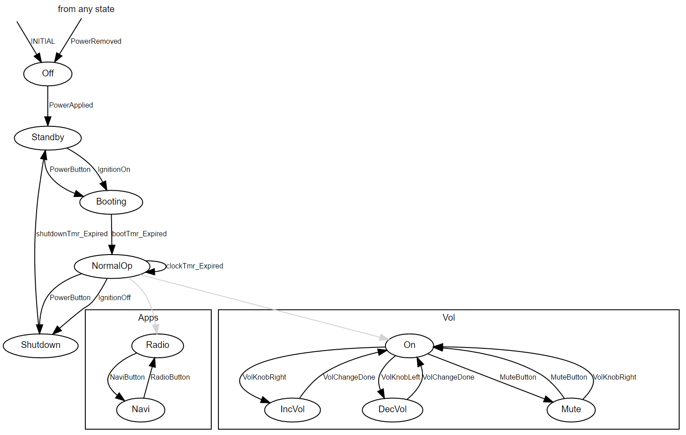

.. include:: ../globals.rst

.. _detailed_fsm:

*********************************************
Modelling with Finite State Machines
*********************************************

Instead of using the event-callback based mechanism described in the previous chapter, 
it is sometimes easier to describe your model with finite state machines (FSMs).
In moddy, FSMs are defined using the python language directly in your model code by creating a 
class derived from the Moddy :class:`~.fsm.Fsm` class.
 
Moddy FSMs features:

*	Simple FSM specification using a python dictionary
*	Simple interface to simulator events (Message reception and timer events)
*	Generation of graphical representation of the state machine
*	FSM-events trigger transitions between states
*	Action-callbacks for state-entry, state-exit, state-do
*	Support for nested state machines, including orthogonal (parallel) nested state machines

Intentionally NOT supported are actions on transitions, because they make FSMs more difficult to read.

Specifying the FSM
===================

Let's begin with a simple FSM, describing the states of a (simplified) computer:

.. figure:: ../_static/0100_computerfsm.png 
 

 
Note that this figure is generated by Moddy using :func:`~.dot_fsm.gen_fsm_graph()`.

In moddy, this state machine can be expressed as follows:

.. code-block:: python

    class Computer(moddy.Fsm):
   
       def __init__(self, parent_fsm=None):
           
           transitions = { 
               '':
                   [('INITIAL', 'off')],
               'off': 
                   [('PowerApplied', 'standby')],
               'standby':
                   [('PowerButtonPressed', 'normal_op')],
               'normal_op':
                   [('PowerButtonPressed', 'standby'),
                    ('OsShutdown', 'standby')],
               'any':
                   [('PowerRemoved', 'off')]
           }
           
           super().__init__( dict_transitions=transitions, parent_fsm=parent_fsm )

The state and the transitions are specified as a python dictionary:

.. code-block:: python

	{ state1: [transition1, transition2, ...], state2: [transition1, transition2, ...], ... }
	
The dictionary keys are the states. In the example above, the state machines regular states 
are 'off', 'standby' and 'normal_op' (the two special states '' and 'any' are described below).

Each dictionary element's value is a list of transitions valid in the specified state. 
Each transition is specified as a tuple:

.. code-block:: python

	(event, target-state)

In the example above, the ``('PowerApplied', 'standby')`` transition is valid in the 'off' state. 
It defines that the 'PowerApplied' event leads to state 'standby'.

There are two special states:

	* The start state is specified with an empty string. When the state machine is started, 
	  it automatically executes the 'INITIAL' event, which transits to the initial state ('off' in our example).
	* Transitions defined in the pseudo state 'any' are valid in any state. 
	  In our example, the 'PowerRemoved' event leads to 'off' state, regardless of the current FSM state.

Generating FSM Events
=====================

Before you can work with an FSM, you must instantiate and start it:

.. code-block:: python

	comp = Computer()
	comp.start_fsm()

The :meth:`~.fsm.Fsm.start_fsm()` method issues automatically the 'INITIAL' event and transits to the initial state. 

To force transitions of the FSM, your model generates FSM events using the :meth:`~.fsm.Fsm.event()` method. 

The current FSM state can be read from the state member:

.. code-block:: python

    comp.event('PowerApplied')
    print("State %s" % comp.state)
    comp.event('PowerButtonPressed')
    print("State %s" % comp.state)
    comp.event('PowerRemoved')
    print("State %s" % comp.state)

This produces the following output:

.. code-block:: console

	State standby
	State normal_op
	State off

Note that the :meth:`~.fsm.Fsm.event()` method return value tells you if the event caused a state change 
(True) or not (False).

Action Callbacks
================

You can define callbacks that are executed when 

	* A state is entered (Entry Action)
	* A state is left (Exit Action)
	* A state is entered or a self-transition is execute (Do Action)

These callbacks are optional. They are only executed when the corresponding methods are defined in the FSM class. 
The callbacks must be named according to the following convention:

	``state_<state>_<action>`` 

These callbacks have no parameters.

Example:

.. code-block:: python

    class Computer(moddy.Fsm):
		...
            def state_off_entry(self):
                print("state_off_entry")
        
            def state_off_exit(self):
                print("state_off_exit")

You can also define callbacks that are executed in any state:

.. code-block:: python

            def state_any_entry(self):
                print("Any State Entry")

The Do Action
-------------

The Do Action is executed when

	* A state is entered, directly after the Entry Action
	* On a state self-transition 

A state self-transition is a transition whose source and target state are identical. 
In this case, the Exit and Entry Actions are NOT executed, but the Do Action is executed.

Executing Application Specific, State-Dependent Callbacks
---------------------------------------------------------

The mechanisms to execute the Entry/Exit/Do Actions can be used also directly for application specific purposes.
Consider the following situation: The object implementing the FSM should receive data from another object, 
but how the data is processed, depends on the FSMs state.

For this purpose, the FSM class provides :meth:`~.fsm.Fsm.exec_state_dependent_method()`.
 
Example: The "Computer" shall receive data only when it is in "normal_op" State:

.. code-block:: python

    class Computer(moddy.Fsm):
		...
            def state_normal_op_receive_data(self, data):
                print("normal_op_receive_data", data)
            def state_standby_receive_data(self, data):
                print("standby_receive_data", data)

Now, when you execute

.. code-block:: python

    comp.exec_state_dependent_method( 'receive_data', True, data='123' )        

the ``state_<state>_receive_data`` function with the argument ``data='123'`` of the corresponding state is 
executed (or none if no such method exists for the current state).

The detailed signature is 

.. code-block:: python

	method_was_called = exec_state_dependent_method(methodName, deep, *args, **kwargs):

where 

    * *method* is the method name to call.
    
        - First ``state_any_<method>`` is called (if it exists), then
        - ``state_<state>_<method>`` is called (if it exists) where state is the current FSM state. 

    * If *deep* is True, the call is also propagated to all currently active sub-state machines, 
      before the calls to the top level state machine
    * \*args and \**kwargs are the positional and named arguments to pass to the method
    * The return value is True if at least one method could be called
	
Nested FSMs
===========

Nested FSMs are needed if one or more of the FSMs states contains sub-states.

The following example shows a state machine with two sub-state machines. 
This example can be found in the moddy tutorial ``3_carinfo.py``. 
It simulates the behaviour of a simplified car infotainment system. 
The main state machine models the devices global state. The "normal_op" states has two substates: 
The first is "Apps" which switches between the Radio Application and the Navigation Application. 
The second is "Vol" which controls the audio volume based on button events. 
The two sub state machines are both active at the same time (as long as the main state machine is in the "normal_op" state.

Note that the graphical representation of sub-states in Moddy is a little unconventional, 
mainly due to the limitations of the GraphViz tool. The sub-states are drawn in separated container boxes, 
whereas they are normally drawn inside the containing super-state. 

 
 
To specify sub-states in a FSM, specify the sub-states name and the sub-state class as follows:

.. code-block:: python

	class CarInfoSystem(moddy.SimFsmPart):
	
	
	    ...
	    class FSM(moddy.Fsm):
	        def __init__(self):
	            
	            transitions = { 
	                    [('INITIAL', 'off')],                
	                'off': 
	                    [('PowerApplied', 'standby')],
	                'standby':
	                    [('PowerButton', 'booting'),
	                     ('IgnitionOn', 'booting')],
	                'booting':
	                    [('boot_tmr_expired', 'normal_op')],
	                'normal_op':
	                     # The following two lines specify nested state machines,  
	                     # executing in parallel
	                    [('Apps' , CarInfoSystem.FSM.ApplicationsFsm ),  
	                     ('Vol' , CarInfoSystem.FSM.VolumeFsm ),
	                     # Normal tranisitions
	                     ('PowerButton', 'Shutdown'),         
	                     # ...
	            }
	            
	            super().__init__( dict_transitions=transitions )
	
	        # Nested state machine CarInfo System Applications
	        class ApplicationsFsm(Fsm):
	        
	            def __init__(self, parent_fsm):
	                
	                transitions = { 
	                    '':
	                        [('INITIAL', 'radio')],
	                    'Radio': 
	                        [('NaviButton', 'navi')],
	                    'Navi':
	                        [('RadioButton', 'radio')]
	                }
	                
	                super().__init__( dict_transitions=transitions, parent_fsm=parent_fsm )

			...

This means sub-states are defined in the list of transitions. 
If the Fsm class code detects that a class reference is given instead a string with a target state, 
it treats this as a sub-state machine specification.

Sub-State Machine Instantiation
-------------------------------

A sub-state machine object is created when the super-state is entered. 
(In our example above, the ApplicationFsm and VolumeFsm objects are created when the super-state 'normal_op' is entered). 
The sub-state machine then automatically execute the 'INITIAL' event to transit to their initial state.

Sub-State Machine Termination
-------------------------------

A sub-state machine object is terminated when the super-state exits. 
When the super-state exits, the Exit action of the current states are called: 
First, the Exit Action of the current state in the sub state machines, and then the Exit Action of the 
current state of the super-state machine. Then the sub-state machine objects are deleted.

Sub-State Machine Event Reception
----------------------------------

All currently active sub-state machines receive the events that are generated at the super-FSM. 
The super-FSM first forwards any event to all its sub-state machines. 
Only if none of the sub-state machines "knows" the event, the event is processed at the super-FSM itself. 
A sub-state machine is said to "know" an event if the event is listed in the transitions list passed 
to the constructor (it doesn't matter in which state).

In the "carinfo" example, if the Main-FSM is in the 'normal_op' state and receives the 'NaviButton' event, 
the event is processed only in the ApplicationFsm sub-state machine, 
because only this FSM knows the 'NaviButton' event.
However, if the Main-FSM is in the 'normal_op' state and receives the 'PowerButton' event, 
the event is processed in the Main-FSM, because no sub-state machine knows this event.

Accessing Super-FSMs from Sub-State Machines
--------------------------------------------

Sometimes sub-state machine want to send events to higher level state machines, 
to force a ransition at the higher level state machine.

A sub-state machine can get a reference to the next higher level FSM using the `parent_fsm` member:

.. code-block:: python

    self.parent_fsm.event('MyEvent')

If you want to send an event to the highest level FSM, use the :meth:`~.fsm.Fsm.top_fsm()` method:

.. code-block:: python

    self.top_fsm().event('MyEvent')

.. _detailed_fsm_part:

Modelling a Moddy Part with a Finite State Machine
==================================================

Moddy provides a convenience class :class:`~.fsm_part.SimFsmPart` to specify a Moddy Part with a FSM.

The SimFsmPart class provides the following features:

	* The FSMs state is represented on the sequence diagram's life line via the status box
	* Messages received on input ports and timer expiration events can generate FSM events

Creating a SimFsmPart
---------------------

To create a part that is controlled by a FSM, create a sub-class of :class:`~.fsm_part.SimFsmPart`. 
You see in the example below that you need to create a nested class containing the FSM (here called class "FSM") 
and pass an instance of this class to the SimFsmPart's constructor:

.. code-block:: python

	import moddy
	
	class CarInfoSystem(moddy.SimFsmPart):
	
	    def __init__(self, sim, obj_name):
	        status_box_repr_map = {
				...	
	        }
	        
	        
	        super().__init__(sim=sim, obj_name=obj_name, fsm=self.FSM(), 
			status_box_repr_map=status_box_repr_map)
	
	        # Ports & Timers
	        self.create_ports('in', ['power_port', 'ignition_port', 'button_port'])
	        self.create_ports('out', ['audio_port', 'visual_port'])
	        self.create_timers(['boot_tmr', 'shutdown_tmr', 'clock_tmr'])
	
	        
	    class FSM(moddy.Fsm):
	        def __init__(self):
	            
	            transitions = { 
	                '': # FSM uninitialized
	                    [('INITIAL', 'off')],                
	                'off': 
				...
				
Representation of the FSM State on the Life Line
------------------------------------------------

An instance of :class:`~.fsm_part.SimFsmPart` automatically shows its FSM state on the part's life line.

.. warning:: 
	The life line cannot show states of nested FSMs, only the state of the highest level FSM can be shown.
	
To define how the FSM state are represented on the part's life line, you define for each state the text and the colours:

.. code-block:: python

	white_on_green = {'boxStrokeColor':'black', 'boxFillColor':'green', 
  	                  'textColor':'white'}

.. note:: 
	You can use also one of the predefined appearance constants, see :ref:`predef-bc-colors`

	

.. code-block:: python

	class CarInfoSystem(moddy.SimFsmPart):
	
	    def __init__(self, sim, obj_name):
	
	        status_box_repr_map = {
	            'off':      (None, moddy.BC_BLACK_ON_WHITE),
	            'standby':  ('SBY', moddy.BC_BLACK_ON_RED),
	            'booting':  ('BOOT', moddy.BC_BLACK_ON_BLUE),
	            'normal_op': ('NORM', moddy.BC_BLACK_ON_GREEN),
	            'Shutdown':  ('SD', moddy.BC_BLACK_ON_RED)
	        }

For each FSM state, a tuple ``(text, appearance)`` has to be defined. 

If you specify the map to be None or if you don't specify a mapping for a specific state, 
then the text shown at the life line will be the state name and the status box colours will be the default colours. 
Using the map shown above, will result in the following sequence diagram:

.. figure:: ../_static/0120_fsmcolor.png 
 

 
Message Handling
----------------

Now, how to connect moddy messages to FSMs?

If a Moddy message is received on an input port owned by a SimFsmPart, it either 

	1) generates directly an FSM event or 
	2) executes a callback function, which can analyse the message and then generate an FSM event

Usually, you want use option 2), i.e. analyse the message first.

In this case, create a callback function for the port that will receive the message. 
E.g. if your port is called *ingition_port* and you want to receive the messages in any state:

.. code-block:: python

    class FSM(moddy.Fsm):
        ...
        def state_any_ignition_port_msg(self, msg):
            if msg == 'on':
                self.event('IgnitionOn')
            elif msg == 'off':
                self.event('IgnitionOff')

So the callback function must be named always ``state_<state>_<port_name>_msg``. 
It is passed the message *msg* which was received on the port.

However, if you don't need to analyse the message content, you can also let moddy generate directly an FSM event. 
For this, specify in your transitions list an event called ``<port_name>_msg``:

.. code-block:: python

    class FSM(moddy.Fsm):
        def __init__(self):
            
            transitions = { 
                ...
                'standby':
                    [('PowerButton', 'booting'),
                     ('ignition_port_msg', 'booting')],

If the :class:`~.fsm_part.SimFsmPart` logic recognizes that your FSM knows an event ``<port_name>_msg``, 
it generates this event whenever a message is received on the port and it does NOT call the callback 
function ``state_<state>_<port_name>_msg``.

Timer Handling
--------------

Timer handling in :class:`~.fsm_part.SimFsmPart` is very similar to message receiption. 
Also here, you can chose to let moddy directly generate an event when a timer expires, 
or to execute a callback function. But for timers, you normally let moddy directly generate events:

.. code-block:: python

  class FSM(moddy.Fsm):
        def __init__(self):
            
            transitions = { 
                ...
                'booting':
                    [('boot_tmr_expired', 'normal_op')],
            }

Here, the :class:`~.fsm_part.SimFsmPart` generates the ``boot_tmr_Expired`` event, when the timer named *boot_tmr* expires.

If you don't have the ``boot_tmr_Expired`` event in your transitions list, 
:class:`~.fsm_part.SimFsmPart` will attempt to execute a callback function ``state_<state>_<timer_name>_expired``.

