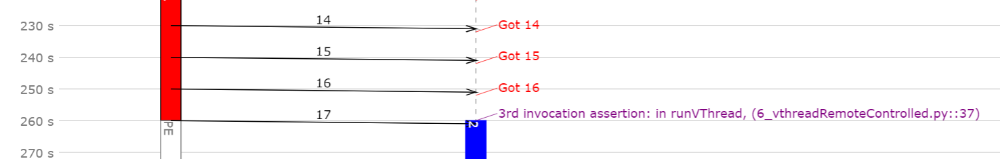

.. include:: ../globals.rst

.. _detailed_modelchecking:

*********************************************
Model Checking
*********************************************

Model Assertions
==========================

Moddy 1.5 added a possibility for checkers in the model to tell the simulator that it detected 
some abnormal situation, e.g. encountered an invalid state, a result is out of range or some timeout has occurred.

A moddy part can call the following method to signal a problem 
(An example can be found in ``6_vthreadRemoteControlled.py``):

.. code-block:: python
	
	self.assertion_failed('3rd invocation assertion')

By default, such an assertion failure causes the simulation to stop, 
unless you pass ``stopOnAssertionFailure=False`` to the simulators :meth:`~.simulator.sim.run()` method. 
In this case, the simulator gathers all assertions during the simulation 
and prints a summary at the end of the simulation:

.. code-block:: console
	
	1 Assertion failures during simulation
	    260.0s 3rd invocation assertion: in runVThread, (6_vthreadRemoteControlled.py::37)

Assertion failures are also displayed in the sequence diagram in purple color: 
 
 

 

Model Monitors
==========================

Moddy 1.10 added a possibility to register functions that gets called at each simulation
step. More specifically, they are called at the *end* of each simulation step, after
the scheduled event has been executed.

This can be useful e.g. to check if some model variable is within the allowed
range.

Monitor functions can be dynamically added and deleted.

Monitor functions are executed in the context of the simulator and get called without
arguments.

See :meth:`~.simulator.sim.addMonitor()` and :meth:`~.simulator.sim.deleteMonitor()`.

Using a model monitor in a Stimulation Program
----------------------------------------------

Moddy 1.10 introduced the :meth:`~.vThread.waitForMonitor` method to suspend the
thread until the monitor returns ``True``.

Example:

.. code-block:: python

        class myThread1(vSimpleProg):
            def __init__(self, sim ):
                super().__init__(sim=sim, objName='Thread', parentObj=None)
           
             
            def runVThread(self):
                cycle = 0
                while True:
                    self.busy(30, 'DEL#%d' % cycle)
                    self.wait(10)
                    cycle += 1
                    
        class stimThread(vSimpleProg):
            def __init__(self, sim, supervisedThread ):
                super().__init__(sim=sim, objName='Stim', parentObj=None)
                self.supervisedThread = supervisedThread 
            def runVThread(self):
                self.waitForMonitor(None, self.monitorFunc1)
                self.annotation('got mon1')
                self.waitForMonitor(None, self.monitorFunc3)
                self.annotation('got mon3')
                if self.waitForMonitor(10, self.monitorFunc1) == 'timeout':
                    self.annotation('tout waiting for mon1')

            def monitorFunc1(self):
                # called in the context of the simulator!
                return self.supervisedThread._stateInd == "DEL#1"
                    
            def monitorFunc3(self):
                # called in the context of the simulator!
                return self.supervisedThread._stateInd == "DEL#3"

        simu = sim()
                        
        t1 = myThread1(simu)
        
        stim = stimThread(simu, t1)
        
        simu.run(200)
        

 