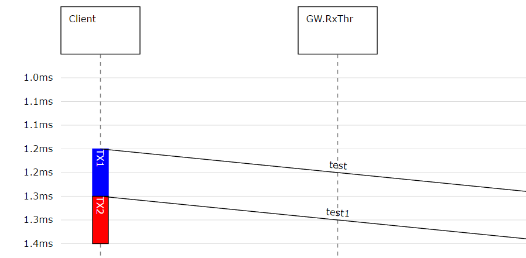
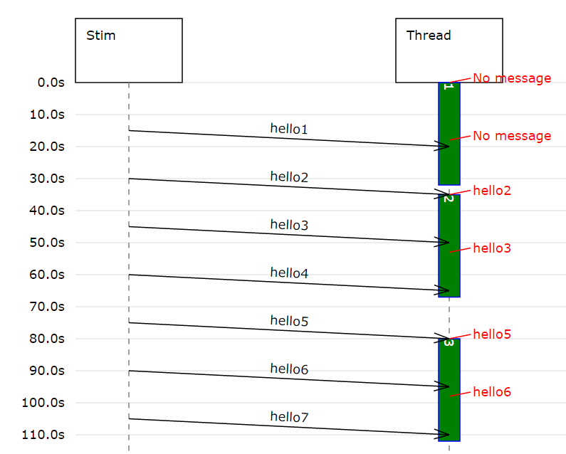
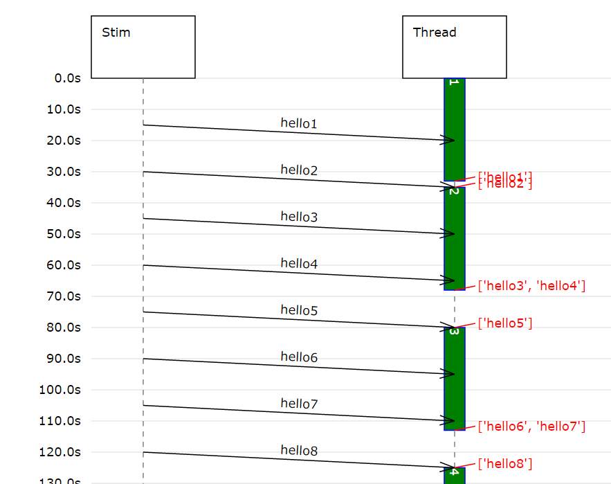

.. include:: ../globals.rst

.. _detailed_seqprog:

*********************************************
Sequential Program Simulation
*********************************************

With the message and timer callbacks explained before, you can model already everything.

However, when you want to model a sequential execution, 
it can be quite cumbersome to do this with the event based mechanism. 
For example if you want to model the execution of a software program like this

	* Get inputs (from Moddy messages), takes 100 |microseconds|
	* Calculate, takes 1ms
	* Set outputs, takes 200 |microseconds|
	
With the event based mechanism, you would need a state machine in the timer's callback routine, 
which is not easy to understand.

So Moddy allows an alternative way to model those sequential programs, simply called "Programs" in the following.
 
To create a "program", your Part must be a subclass of either :class:`~.vthread.VThread` 
or :class:`~.vt_sched_rtos.VSimpleProg`. 
(More about the difference between them in chapter :ref:`diff-simpleprog-and-vthread`).

Program Model
=============

.. code-block:: python

	
	class Client(moddy.VSimpleProg):
	    def __init__(self, sim):
	        super().__init__(sim=sim, obj_name="Client", parent_obj=None)
	        self.create_ports('QueuingIO', ['net_port']) 
	
	    def run_vthread(self):
	        while True:
	            self.wait(1.2*MS)
	            self.net_port.send('test', 100*US)
	            self.busy(100*US, 'TX1', whiteOnBlue)
	            self.net_port.send('test1', 100*US)
	            self.busy(100*US, 'TX2', whiteOnRed)
   

 

In the above example, you see a very simple sequential program, that is

	* Idle (waiting) for 1.2ms
	* Performing a send "TX1" operation, which takes 100 |microseconds|
	* Performing a send "TX2" operation, which takes 100 |microseconds|

Moddy parts derived from :class:`~.vthread.VThread` or :class:`~.vt_sched_rtos.VSimpleProg` 
must implement a method :meth:`~.vthread.VThread.run_vthread`. This method contains your sequential program model. 

It is called at the start of the simulation time (simulation time 0).

The :meth:`~.vthread.VThread.run_vthread` method is not supposed to exit/return, that's why it contains an endless loop. 
(However, for remote controlled vThreads it makes sense to exit/return, see :ref:`remote-controlled-thread` 
for more information)

Since Moddy 1.8, you don't need a subclass of :class:`~.vthread.VThread` or :class:`~.vt_sched_rtos.VSimpleProg` anymore. 
You can pass instead a function to the constructor of :class:`~.vthread.VThread` or :class:`~.vt_sched_rtos.VSimpleProg` via
the `target` parameter. This function (in the example below ``bob_prog`` is then called from :meth:`~.vthread.VThread.run_vthread`:

.. code-block:: python

	def bob_prog(self: moddy.VSimpleProg):
	    # bob starts talking
	    self.head.send("Hi Joe", 1)
	    
	    while True:
	        msg = self.wait_for_msg(None, self.head)

	if __name__ == '__main__':
	    simu = moddy.Sim()
    
	    VSimpleProg( sim=simu, obj_name="Bob", target=bob_prog, elems={ 'QueuingIO': 'head' } )

The program model in :meth:`~.vthread.VThread.run_vthread` can control the timing of the program via "system calls":

	* :meth:`~.vthread.VThread.wait()` delays the program execution for a specified time or 
	  until an event occurred, indicating that the program is idle. No status box is shown on 
	  the sequence diagram life line while a program is waiting
	* :meth:`~.vthread.VThread.busy()` delays the program execution for the specified time. 
	  A user defined status box (e.g. 'TX1' in the example above occurs) is shown on the life line 
	  while the program is busy.
	
.. note::
 
	Moddy executes each :meth:`~.vthread.VThread.run_vthread` method in a separate python thread. 
	But don't worry: Race conditions resulting from concurrent execution cannot occur in Moddy, 
	because Moddy executes exactly only one thread at each time, either the simulator thread or one of the vThreads. 
	There is no need to protect your data via mutexes.
	
Communication between Moddy Programs and other Moddy Parts
===========================================================

Like normal Moddy parts, Moddy Programs shall communicate with other parts only via Moddy messages. 
To send messages, a Moddy program can use standard output ports. There is no difference to other parts.

But a standard input port executes a callback method. 
It cannot tell the program that a message has been received (other than setting a global variable). 
For this reason, Moddy provides "buffering input ports".

Buffering Input Ports
=====================

A buffering input port buffers received messages in the part's local memory and eventually wakes up the program.
There are two types of buffering ports

	* Sampling Port: A sampling port is used if the receiver is only interested in the most recent message. 
	
		* A sampling port buffers only the last received message.  
		* A read from the sampling buffer does not consume the buffered message
		
	* Queuing Port: A queuing port is used if the receiver wants to get all messages. 
	
		* A queuing port buffers all messages in a fifo queue. The queue depth is infinite. 
		* A read from the buffer consumes the first message

Buffering input ports are derived from :class:`~.vthread.VtInPort`.
 
A program reads a message from a buffering ports via the :meth:`~.vthread.VtInPort.read_msg()` method.
 
It can check the number of messages in the buffer through the :meth:`~.vthread.VtInPort.n_msg()` method.

A program can wait for new message using the :meth:`~.vthread.VThread.wait()` method, or alternatively 
wait for a message and read the first available message through :meth:`~.vthread.VThread.wait_for_msg()`.
   
The exact behavior depends on the type of buffer port (Sampling or Queuing) and will be explained in the following.

Sampling Input Ports
--------------------

Recall from previous chapter:

	* A sampling port buffers only the last received message.  
	* A read from the sampling buffer does not consume the buffered message

A sampling input port (:class:`~.vthread.VtSamplingInPort`) is created with the :meth:`~.vthread.VThread.create_ports()` 
method, usually from the program's constructor:

.. code-block:: python

	self.create_ports('SamplingIn', ['in_p1'])

The :meth:`~.vthread.VtInPort.read_msg()` method on a sampling input port returns the most recent message received. 
If no message at all was received, it returns either the "default" (if provided) or raises a BufferError exception. 

If you call :meth:`~.vthread.VtInPort.read_msg()` and now new message has arrived since the 
last :meth:`~.vthread.VtInPort.read_msg()` call, you get the same message again. Example:

.. code-block:: python

	msg = self.in_p1.read_msg(default='123')

The :meth:`~.vthread.VtInPort.n_msg()` method returns 0 if no message was received at 0, or 1 otherwise. 
A program can call :meth:`~.vthread.VThread.wait()` so that is woken up if a message arrives on the port:

.. code-block:: python

	self.wait(20, [self.in_p1])

A sampling input port wakes up a waiting program with every message that arrives.

The following snippet demonstrates the use of a sampling port.
*MyThread1* is a program that has a sampling input port *in_p1*, while *StimThread* is firing messages to that port.

.. code-block:: python

       class MyThread1(moddy.VSimpleProg):
            def __init__(self, sim ):
                super().__init__(sim=sim, obj_name='Thread', parent_obj=None)
                self.create_ports('SamplingIn', ['in_p1'])
                
            def show_msg(self):
                msg = self.in_p1.read_msg(default='No message')
                self.annotation(msg)
                
            def run_vthread(self):
                cycle=0
                while True:
                    cycle += 1
                    self.show_msg()
                    self.busy(18,cycle, busy_appearance)
                    self.show_msg()
                    self.busy(14,cycle, busy_appearance)
                    self.wait(20,[self.in_p1])

        class StimThread(moddy.VSimpleProg):
            def __init__(self, sim ):
                super().__init__(sim=sim, obj_name='Stim', parent_obj=None)
                self.create_ports('out', ['to_t1_port'])
                                
            def run_vthread(self):
                count=0
                while True:
                    count+=1
                    self.wait(15)
                    self.to_t1_port.send('hello%d' % count,5)

This would result in the following sequence diagram:
   

 
 
Queuing Input Ports
-------------------

Recall from previous chapter:
	
	* A queuing port buffers all messages in a fifo queue. The queue depth is infinite. 
	* A read from the buffer consumes the first message

A queuing input port (:class:`~.vthread.VtQueuingInPort`) is created with the :meth:`~.vthread.VThread.create_ports()` 
method, usually from the program's constructor:

.. code-block:: python

	self.create_ports('QueuingIn', ['in_p1'])

The :meth:`~.vthread.VtInPort.read_msg()` method on a queuing input port returns the first message of the queue. 
If no message is in the queue, it raises a BufferError exception.
 
The :meth:`~.vthread.VtInPort.n_msg()` method returns the number of messages in the queue (0 if none).

A program can call :meth:`~.vthread.VThread.wait()` so that is woken up when a the first message an empty queue arrives on the port:

.. code-block:: python

	self.wait(20, [self.in_p1])

.. warning::

	Call :meth:`~.vthread.VThread.wait()` only on empty queuing ports, 
	otherwise the program will not be woken up (because the wakeup happens only at empty->non-empty transitions)!
	Alternatively, use :meth:`~.vthread.VThread.wait_for_msg()`
	
The following snippet demonstrates the use of a queuing port. 
*MyThread1* is a program that has a queuing input port *in_p1*, while *StimThread* is firing messages to that port.

.. code-block:: python

       class MyThread1(moddy.VSimpleProg):
            def __init__(self, sim ):
                super().__init__(sim=sim, obj_name='Thread', parent_obj=None)
                self.create_ports('QueuingIn', ['in_p1'])
            
            def get_all_msg(self):
                lst_msg = []
                while True:
                    try:
                        msg = self.in_p1.read_msg()
                        lst_msg.append(msg)
                    except BufferError:
                        break
                
                self.annotation(lst_msg)
         
             
            def run_vthread(self):
                cycle=0
                while True:
                    cycle += 1
                    self.busy(33, cycle, busy_appearance)
                    self.get_all_msg()
                    self.wait(20, [self.in_p1])
                    self.get_all_msg()

        class StimThread(moddy.VSimpleProg):
            def __init__(self, sim ):
                super().__init__(sim=sim, obj_name='Stim', parent_obj=None)
                self.create_ports('out', ['to_t1_port'])
                                
            def run_vthread(self):
                count=0
                while True:
                    count+=1
                    self.wait(15,[])
                    self.to_t1_port.send('hello%d' % count,5)

   

 
Since Moddy 1.8, :meth:`~.vthread.VThread.wait_for_msg()` is available. This method waits for a message on any of the
specified ports and returns the first available message:

.. code-block:: python

    def run_vthread(self):
        while True:
            # Wait for a message on either in_p1 or in_p2.
            # Because 2 ports have been specified, wait_for_msg returns a tuple with (msg, port) or None
            rv = self.wait_for_msg(30, [self.in_p1, self.in_p2])

            # Wait for a message on in_p2.
            # Because 1 port has been specified, wait_for_msg returns a just the msg or None
            rv = self.wait_for_msg(30, self.in_p2)

System Calls for Sequential Programs
====================================

In the previous chapters, the system calls :meth:`~.vthread.VThread.wait()` and :meth:`~.vthread.VThread.busy()` 
were already briefly introduced. Now in more detail:

:meth:`~.vthread.VThread.wait()` delays the program execution for a specified time or until an event occurred.
The model is indicating with :meth:`~.vthread.VThread.wait()` that the program is idle. 
Therefore no status box is shown on the sequence diagram life line while a program is waiting.

.. autofunction:: moddy.vthread.VThread.wait
	:noindex:
	
:meth:`~.vthread.VThread.busy()` delays the program execution for the specified time. 
The model is indicating with :meth:`~.vthread.VThread.busy()` that the program is performing some operation. 
Therefore, a user defined status box appears on the life line while the program is busy.

.. autofunction:: moddy.vthread.VThread.busy
	:noindex:

Concurrent Program Execution/RTOS Simulation
============================================

Moddy comes with a simulation of a simple RTOS (real time operating system) scheduler (:class:`vt_sched_rtos:vt_sched_rtos`). 

With this feature, you can model SW threads that run concurrently on a single CPU core.
The scheduler has the following features:

	* 16 thread priorities - 0 is highest priority
	* Priority based scheduling. Low priority threads run only if no higher thread ready.
	* Threads with same priority will be scheduled round robin 
	  (when one of the same priority threads releases the processor, 
	  the next same priority thread which is ready is selected). 
	  Note that the round robin occurs not periodically. 
	  It happens only when one task executes :meth:`~.vthread.VThread.wait()`.
	  
	  
First, you create the scheduler object:

.. code-block:: python

	sched= vt_sched_rtos(sim=simu, obj_name="sched", parent_obj=None)

Then you add the threads (subclasses of VThread) that shall be scheduled by the scheduler:

.. code-block:: python

        t1 = MyThread1(simu)
        t2 = MyThread2(simu)
        t3 = MyThread3(simu)
        sched.add_vthread(t1, prio=0)
        sched.add_vthread(t2, prio=1)
        sched.add_vthread(t3, prio=1)

Example snippet:

.. code-block:: python

       class MyThread1(moddy.VThread):
            def __init__(self, sim ):
                super().__init__(sim=sim, obj_name='hiThread', parent_obj=None)
            def run_vthread(self):
                print("   VtHi1")
                self.busy(50,'1',busy_appearance)
                print("   VtHi2")
                self.wait(20,[])
                print("   VtHi3")
                self.busy(10,'2',busy_appearance)
                print("   VtHi4")
                self.wait(100,[])
                print("   VtHi5")
                self.wait(100,[])
                while True:
                    print("   VtHi5")
                    self.busy(10,'3',busy_appearance)
                    self.wait(5,[])
    
        class MyThread2(moddy.VThread):
            def __init__(self, sim ):
                super().__init__(sim=sim, obj_name='lowThreadA', parent_obj=None)
            def run_vthread(self):
                print("   VtLoA1")
                self.busy(50,'1',busy_appearance)
                print("   VtLoA2")
                self.wait(20,[])
                print("   VtLoA3")
                self.busy(20,'2',busy_appearance)
                print("   VtLoA4")
                self.busy(250,'3',busy_appearance)
            
        class MyThread3(moddy.VThread):
            def __init__(self, sim ):
                super().__init__(sim=sim, obj_name='lowThreadB', parent_obj=None)
            def run_vthread(self):
                print("   VtLoB1")
                self.busy(50,'1',busy_appearance)
                print("   VtLoB2")
                self.wait(20,[])
                print("   VtLoB3")
                self.busy(100,'2',busy_appearance)
                print("   VtLoB4")
                self.busy(250,'3',busy_appearance)
    
        simu = sim()
        sched= vt_sched_rtos(sim=simu, obj_name="sched", parent_obj=None)
                
        t1 = MyThread1(simu)
        t2 = MyThread2(simu)
        t3 = MyThread3(simu)
        sched.add_vthread(t1, 0)
        sched.add_vthread(t2, 1)
        sched.add_vthread(t3, 1)

Resulting in the following sequence diagram:
 
   
.. figure:: ../_static/0230_rtos.png 
 
Note: The "PE" status indicator tells you that the thread is "preempted", i.e. 
it would be ready to run, but it has to wait for the CPU resource, because a higher priority thread is busy.

.. _diff-simpleprog-and-vthread:

VSimpleProg and VThread
=======================

:class:`~.vt_sched_rtos.VSimpleProg` is a specialization of :class:`~.vthread.VThread`. 
:class:`~.vt_sched_rtos.VSimpleProg` uses an exclusive scheduler for the program, so there are no concurrent threads.
A :class:`~.vthread.VThread` must be explicitly assigned to a scheduler.

Example for a VSimpleProg. This creates a moddy part "Producer" with a single thread attached:

.. code-block:: python

	class Producer(moddy.VSimpleProg):
	    def __init__(self, sim):
	        super().__init__(sim=sim, obj_name="Producer", parent_obj=None)
	        self.create_ports('out', ['net_port']) 
	
	    def run_vthread(self):
	        while True:
	            self.wait(100*US)
	            self.net_port.send('test', 100*US)

.. _remote-controlled-thread:

Remote Controlled vThreads
==========================

Remote Controlled vThreads are for instance useful to model computer systems that execute software, 
but only if the computer is turned on, and another moddy part shall be able to turn on/off the computer. 
Another example could be Software processes which shall be terminate-able and restart-able.

Normal vThreads are started automatically at the beginning of the simulation and they are supposed to 
run until the end of the simulation. 
Since Moddy 1.5.0, remote controlled vThreads are supported. Subclasses of vThreads like 
:class:`~.vt_sched_rtos.VSimpleProg` also have the remote control feature.

Remote Controlled vThreads can be controlled (started and killed) from other moddy parts via a 
moddy input port called ``_thread_control_port``. 

Remote Controlled vThreads are not started automatically, but wait for a "start" message on the _thread_control_port.
To create a remote controlled VThread, pass ``remoteControlled=True`` to the VThread's __init__ method. 
In another moddy part, create an output port and bind it to ``_thread_control_port``.

Extract from tutorial 6_vthread_remote_controlled.py:

.. code-block:: python

    class MyRcThread(moddy.VThread):
        def __init__(self, sim):
            super().__init__(
                sim=sim,
                obj_name="rcThread",
                parent_obj=None,
                remote_controlled=True,
            )
	
    # This thread controls the remote controllable VThread
    def stim_prog(self):

        # @2s: initial start of rcTread
        self.wait_until(2)
        self.rc_port.send("start", 0)

        ...

        # @180s: kill rcThread
        self.wait_until(180)
        self.rc_port.send("kill", 0)

	        
    if __name__ == "__main__":
        SIMU = moddy.Sim()
        SIMU.tracing.set_display_time_unit("s")

        SCHED = moddy.VtSchedRtos(sim=SIMU, obj_name="sched", parent_obj=None)
        rc_thread = MyRcThread(SIMU)
        util_thread = moddy.VThread(
            sim=SIMU,
            obj_name="utilThread",
            target=util_prog,
            elems={"out": "to_rc_port"},
        )
        SCHED.add_vthread(rc_thread, 0)
        SCHED.add_vthread(util_thread, 1)

        STIM = moddy.VSimpleProg(
            sim=SIMU, obj_name="Stim", target=stim_prog, elems={"out": "rc_port"}
        )

        SIMU.smart_bind(
            [
                ["rcThread._thread_control_port", "Stim.rc_port"],
                ["utilThread.to_rc_port", "rcThread.from_util_port"],
            ]
        )

On the ``_thread_control_port``, only two string parameters are supported:

    * **start** - Start or restart the VThread's :meth:`~.vthread.VThread.run_vthread` method. 
      If the :meth:`~.vthread.VThread.run_vthread` is already active, the start message is ignored.
	  
    * **kill** - Force the :meth:`~.vthread.VThread.run_vthread` to abort the 
      current :meth:`~.vthread.VThread.busy()` or :meth:`~.vthread.VThread.wait()` 
      call by raising a VThread.KillException. 
      When the :meth:`~.vthread.VThread.run_vthread` has terminated, all pending timers are stopped, 
      all receive queues in the input ports are cleared and no messages can be received while terminated. 
      The kill message is ignored if the VThread is already terminated.

.. note:: 
	Variable persistence: When a thread is re-started, all local variables are lost and must be reinitialized. 
	However, be aware that variables stored in the :class:`~.sim_part.SimPart` object (e.g. self.myvar) will survive a restart. 
