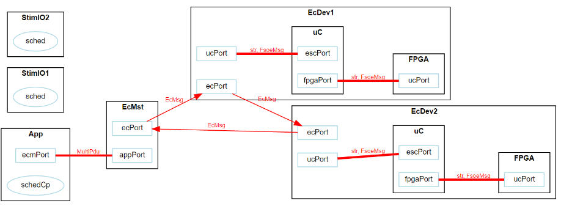

.. include:: ../globals.rst

.. _detailed_visualization:

*********************************************
Visualisation
*********************************************

Sequence Diagram Generation
===========================

Moddy can generate sequence diagrams to show the communication between Moddy parts, including their timing information.

To generate a sequence diagrams, your code must call |genSeqDiag| 
after the simulation has finished. 
The parameters provided to |genSeqDiag| define the appearance of the sequence diagram. 

Moddy generates interactive diagrams, that can be opened in a browser and the time scale 
can be dynamically adjusted to see less or more details.
	   
.. note::
	The static diagram generator has been removed in moddy 2.x

Elements of a sequence diagram
------------------------------

 
.. figure:: ../_static/0400_sd_elements.PNG 
 

Details of a Sequence Diagram
------------------------------

The interactive sequence diagrams are generated as HTML pages with javascript code.

Normally, the viewer embeds the viewer's javascript and css code in the HTML file, however, 
you can specify ``refer_files=True`` to reference the javascript/css files which must be present on your filesystem. 
So, if you want to send the HTML file to someone who has no moddy installation, use ``refer_files=False``.

Current Browser support:

	* Chrome: OK
	* Firefox: OK
	* Microsoft Edge: OK
	* Safari IOS: OK 
	* Internet Explorer (up to IE 11): Does not work
	* Other browsers not tested
	
This is a simple example: 

.. code-block:: python
	
	moddy.gen_interactive_sequence_diagram( 
	                  sim=simu, 
	                  file_name="myExample.html", 
	                  show_parts_list=["Bob", "Joe"],
	                  time_per_div = 1.0) 

A more complex case:

.. code-block:: python

        moddy.gen_interactive_sequence_diagram( 
                                      sim=simu, 
                                      file_name="2_sergw.html", 
                                      title="Serial Gateway Demo",
                                      show_parts_list=[client, gateway.rx_thread,
                                       gateway.tx_thread, ser_dev],
                                      excluded_element_List=['allTimers'], 
                                      time_per_div = 50*US, 
                                      pix_per_div = 30)    

Here, no timer expiration events are shown, the time division is set to 50|micro|s and each 
time division occupies 30 pixels.

Using the Interactive Viewer
----------------------------
 
Please try the following demo: :download:`2_sergw <../tutorials/code/output/2_sergw.html>` 

The major interactive functions of the viewer are:

	* Time Scaling
	
		* A time scale factor of 0.01 ... 100, relative to the initial time resolution is supported. 
		  To change the current time scale
		
			* Use +/- keys on keyboard
			* Use the Time Scale Slider
			* Hold the shift key and move mouse up and down

	* Adaption of part spacing

		* Drag one of the part boxes ("CarInfoSys" in the example above) and move it horizontally. 
		  The parts on the right automatically follow.
		  
		* SHIFT+Drag one of the part boxes (but not the first one) and move it horizontally. 
		  The distances between all parts are changed accordingly.

	* Time Markers

		* Can be used as a ruler or to measure a time delta.
		* Two time markers are supported: A green and a red one.
		* A mouse click somewhere in the diagram activates the green time marker.
		* A CTRL+mouse click somewhere in the diagram activates the red time marker.
		* If both time markers are activated, the delta time between the two time markers is displayed in the title bar.
 

Structure Graph Generation
==========================

Moddy can also generate files to show the static structure of the model. 
Very useful to document the model and to explain the model to others.

An example structure graph:
 

 
* The parts hierarchy is shown: For example, EcDev1 contains two sub-parts: "uC" and "FPGA".
* The ports of a part are shown: For example, EcDev1 has a "ucPort" and an "ecPort".
* The port bindings are shown:

	* The thin, directed arrows show unidirectional bindings, from an output port to an input port.
	* The thick, undirected arrows show bidirectional bindings between IO-Ports.
	
* The message type transferred between ports are shown (e.g. EcMsg): 
  Moddy learns during the simulation which message types (python classes) are transferred.
   
* The relation between schedulers and parts are shown. In the example above, "schedCp" controls "App". 
  In the example below, if the scheduler "sched" controls multiple threads, the relation is shown, 
  including the thread priorities. (WARNING: This feature does not work under all circumstances)

 

 
 
Moddy uses the *GraphViz* command line tool ``dot`` to generate the structure graphs, so *GraphViz* has to be installed. 

The output format is fixed to SVG. 

To generate a structure, just call |genStruct| after running the simulation. 
(You can also run it before the simulation, but then no message types will be shown)

.. code-block:: python

    moddy.gen_dot_structure_graph(simu, '2_sergw_structure.svg')

.. note:: There is currently no way to influence the appearance of the structure graph.

Trace Table Generation
----------------------

Moddy can generate a ``CSV`` (comma separated value) file containing all simulator events. 
This file can be viewed with a table calculation program such as MS Excel.

Example: 

 

 

To generate a trace table, call :func:`~.trace_to_csv.gen_trace_table()` after running the simulation:

.. code-block:: python

    moddyGenerateTraceTable(simu, file_name='1_hello.csv', time_unit=1.0)

Where *time_unit* specifies the time unit for all time stamps in table ('s', 'ms', 'us', 'ns').

Explanation to the events:
	
	* **>MSG**: A message transfer starts. 
	* **>MSG(Q)**: A message transfer starts. The message was delayed because another 
	  message was blocking the output port. The requestTime tells you when the model requested the message send
	  
	* **<MSG**: Message arrived at input port: Note that "Object" specifies the part that contains the output port
	* **T-START**: A timer has been started
	* **T-STOP**: A timer has been stopped
	* **T-RESTA**: A timer was restarted
	* **T-EXP**: A timer was expired
	* **ANN**: Model added an annotation
	* **ASSFAIL:** Assertion failure
	* **STA**: Part changed its status (via setStatusIndicator)

State Machine Graph Generation
==============================

Moddy can also generate graphs to show the finite state machines of the model. 
An example state machine graph (from tutorial ``3_carinfo.py``):
 
.. figure:: ../_static/0440_fsm.png 
 

The "Apps" and "Vol" boxes are sub-states of the "normal_op" state.

To generate a state machine graph, just call :func:`~.dot_fsm.gen_fsm_graph()` after state machine instantiation.

.. code-block:: python

    moddy.gen_fsm_graph( fsm=cis.fsm, file_name='3_carinfo_fsm.svg')

.. note:: There is currently no way to influence the appearance of the graph.

