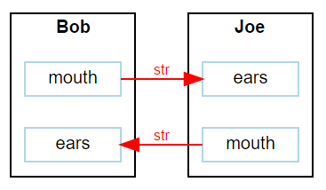

.. include:: globals.rst

.. _quick_start:

***************
Quick Start
***************

The following chapter describes the basic functions of Moddy by using the example 
:file:`tutorial/1_hello.py` tutorial model.

In a Moddy model, a system is composed of parts that communicate with other parts through messages.
In the "hello" tutorial, we simulate a conversation between two people, "Bob" and "Joe", 
therefore "Bob" and "Joe" are the two parts used in the model.

.. note:: 

	This example uses only only of two modelling flavours, the "event based" method. 
	Using this method, the model reacts to events using callback routines.
	
	Another modelling technique is the "program based" method. For more information,
	refer to :ref:`detailed_seqprog`    

Model Structure
===============
The structure of the system is modelled via parts, ports and bindings between ports.
In the "hello" tutorial, we have two parts, Bob and Joe. 
Each part has an output port (mouth) and an input port (ears). 

To simulate the time that Bob and Joe need for thinking, we create also a timer for both.
To model the behavior of Bob, we define a class "Bob", which creates the ports and timers:

.. code-block:: python

	class Bob(simPart)
	
	    def __init__(self, sim, objName):
	        # Initialize the parent class
	        super().__init__(sim=sim, objName=objName)
	
	        # Ports
	        self.createPorts('in', ['ears'])
	        self.createPorts('out', ['mouth'])
	
	        # Timers
	        self.createTimers(['thinkTmr'])
	        self.reply = ""
	
		...

The main program creates an instance of Bob and Joe like this

.. code-block:: python

    simu = sim()
    
    bob    = Bob( simu, "Bob" )
    joe    = Joe( simu, "Joe" )

To allow Joe to hear what Bob says, we "bind" the ears of Joe to the mouth of Bob and vice versa. 
A binding is always initiated from the output port; you call the output port's bind 
function and specify the input port that shall be bound.

.. code-block:: python

    bob.mouth.bind(joe.ears)
    joe.mouth.bind(bob.ears)

Moddy can also output the structure of the model. After you created the structure, call |genStruct|:

.. code-block:: python
    
    # Output model structure graph
    moddyGenerateStructureGraph(simu, '1_hello_structure.svg')

This is the resulting structure graph:

Model Behavior
==============
To model the behavior of parts, your model:
	
	* Sends messages to other parts
	* Reacts on received messages from other parts
	* Reacts on timer events 

This means, the simulator calls the model code only whenever such an event occurs.
For example, Bob's behavior will be modelled as follows:
class Bob(simPart)

.. code-block:: python

    ...
    def earsRecv(self, port, msg):
        if msg == "Hi, How are you?":
            self.reply = "How are you?"
        else:
            self.reply = "Hm?"
        
        self.thinkTmr.start(1.4)
        self.setStateIndicator("Think")
        

    def thinkTmrExpired(self, timer):
        self.setStateIndicator("")
        self.mouth.send(self.reply, 1)

Ports and Messages
==================
A message is send always from an "Output Port" to an "Input Port". 
A part can have many Ports to communicate with other parts.
A message is send via the sending port's send() method:

.. code-block:: python

	self.mouth.send(self.reply, 1)
	
See :meth:`~.simulator.simOutputPort.send` for details.

In this example, self.reply is the message; here it is a string.
The second parameter defines the flight time, i.e. how long it takes until the message 
arrives at the input port.
On the receiver side, the part that owns the input port must define a "receive function", 
which gets passed the message just received:

.. code-block:: python

    def earsRecv(self, port, msg):
        if msg == "Hi, How are you?":
            self.reply = "How are you?"
        else:
            self.reply = "Hm?"
        
        self.thinkTmr.start(1.4)
        self.setStateIndicator("Think")

.. note::
	This receive routine must be called always *<portName>Recv*.

Timers
======
A part can have many timers to control its own behavior.
A timer is stopped by default.

	* You start the timer via timer.start(timeout).
	* You stop (cancel) the timer via timer.stop()
	* You can restart an already running timer via timer.restart(timeout).
	
.. code-block:: python

	def thinkTmrExpired(self, timer):
	        self.setStateIndicator("")
	        self.mouth.send(self.reply, 1)

.. note::
	The expiration routine must be called always *<timerName>Expired*.

Running Simulator
================= 
After the parts and bindings were created, the simulator can :meth:`~.sim.run`

.. code-block:: python

    # let simulator run
    simu.run(stopTime=12.0)

Here we stop the simulator after 12 seconds. If no limit is given, 
the simulator would run until no more events to execute. 
On the python console, the simulator outputs the simulation trace:

.. code-block:: console

	TRC:       0.0s >MSG    Bob.mouth(OutPort) //  req=0.0s beg=0.0s end=1.0s dur=1.0s msg=[Hi Joe]
	SIM: Simulator 1.6.1 starting
	TRC:       1.0s <MSG    Joe.ears(InPort) //  req=0.0s beg=0.0s end=1.0s dur=1.0s msg=[Hi Joe]
	TRC:       1.0s ANN     Joe(Part) // got message Hi Joe
	TRC:       1.0s T-START Joe.thinkTmr(Timer) // 2.0s
	TRC:       1.0s STA     Joe(Part) // Think
	TRC:       3.0s T-EXP   Joe.thinkTmr(Timer)
	TRC:       3.0s STA     Joe(Part) // 
	TRC:       3.0s >MSG    Joe.mouth(OutPort) //  req=3.0s beg=3.0s end=4.5s dur=1.5s msg=[Hi, How are you?]
	TRC:       4.5s <MSG    Bob.ears(InPort) //  req=3.0s beg=3.0s end=4.5s dur=1.5s msg=[Hi, How are you?]
	TRC:       4.5s T-START Bob.thinkTmr(Timer) // 1.4s
	TRC:       4.5s STA     Bob(Part) // Think
	TRC:       5.9s T-EXP   Bob.thinkTmr(Timer)
	TRC:       5.9s STA     Bob(Part) // 
	TRC:       5.9s >MSG    Bob.mouth(OutPort) //  req=5.9s beg=5.9s end=6.9s dur=1.0s msg=[How are you?]
	TRC:       6.9s <MSG    Joe.ears(InPort) //  req=5.9s beg=5.9s end=6.9s dur=1.0s msg=[How are you?]
	TRC:       6.9s ANN     Joe(Part) // got message How are you?
	TRC:       6.9s T-START Joe.thinkTmr(Timer) // 2.0s
	TRC:       6.9s STA     Joe(Part) // Think
	TRC:       8.9s T-EXP   Joe.thinkTmr(Timer)
	TRC:       8.9s STA     Joe(Part) // 
	TRC:       8.9s >MSG    Joe.mouth(OutPort) //  req=8.9s beg=8.9s end=10.4s dur=1.5s msg=[Fine]
	TRC:      10.4s <MSG    Bob.ears(InPort) //  req=8.9s beg=8.9s end=10.4s dur=1.5s msg=[Fine]
	TRC:      10.4s T-START Bob.thinkTmr(Timer) // 1.4s
	TRC:      10.4s STA     Bob(Part) // Think
	TRC:      11.8s T-EXP   Bob.thinkTmr(Timer)
	TRC:      11.8s STA     Bob(Part) // 
	TRC:      11.8s >MSG    Bob.mouth(OutPort) //  req=11.8s beg=11.8s end=12.8s dur=1.0s msg=[Hm?]
	SIM: Stops because stopTime reached
	SIM: Simulator stopped at 12.0s. Executed 9 events in 0.001 seconds
	saved sequence diagram in output/1_hello.html as iaViewer
	Saved structure graph to output/1_hello_structure.svg
	saved output/1_hello.csv as CSV

Generating the Sequence Diagram
===============================

Moddy can generate a sequence diagram from the simulation results. 
The sequence diagram is generated as a as HTML.
After simulation run, the following code generates the sequence diagram. 
For details, see :func:`~.seqDiagInteractiveGen.moddyGenerateSequenceDiagram`:

.. code-block:: python

    moddyGenerateSequenceDiagram( sim=simu, 
                                  fileName="1_hello.html", 
                                  fmt="iaViewer", 
                                  excludedElementList=[], 
                                  timePerDiv = 1.0, 
                                  pixPerDiv = 30) 

This is the result:

.. figure:: _static/0020_1_hello.png 

View as HTML: :download:`1_hello <tutorials/code/output/1_hello.html>`

Notes:

	* The black arrows are messages
	* The blue arrows are timer expiration events
  	* The orange boxes are visualized "states" or "activities" that were generated by the model via setStatusIndication().
	* The red messages are annotations that were generated by the model via addAnnotation()

